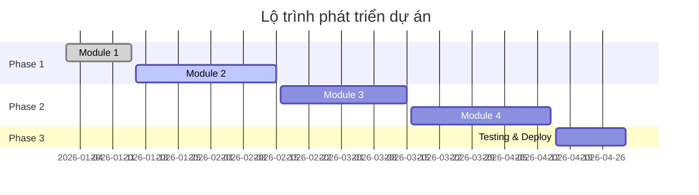

# BÁO CÁO TIẾN ĐỘ DỰ ÁN
**Tên dự án:** [Tên dự án]  
**Người báo cáo:** [Tên người báo cáo]  
**Ngày báo cáo:** [DD/MM/YYYY]  
**Kỳ báo cáo:** [Tuần/Tháng X]  

---

## 1. PHÂN TÍCH YÊU CẦU

### 1.1. Mục tiêu dự án
<!-- Mô tả ngắn gọn mục tiêu chính của dự án -->

### 1.2. Phạm vi công việc
<!-- Liệt kê các module/tính năng chính cần thực hiện -->

- [ ] **Module 1:** [Tên module]
  - Mô tả: [Mô tả ngắn gọn]
  - Độ ưu tiên: [Cao/Trung bình/Thấp]
  
- [ ] **Module 2:** [Tên module]
  - Mô tả: [Mô tả ngắn gọn]
  - Độ ưu tiên: [Cao/Trung bình/Thấp]

### 1.3. Yêu cầu kỹ thuật
<!-- Các công nghệ, framework, thư viện cần sử dụng -->

| Thành phần | Công nghệ | Phiên bản |
|------------|-----------|-----------|
| Framework  | [Tên]     | [Version] |
| Database   | [Tên]     | [Version] |
| UI Library | [Tên]     | [Version] |

### 1.4. Yêu cầu phi chức năng
<!-- Hiệu năng, bảo mật, khả năng mở rộng, v.v. -->

- **Hiệu năng:** [Mô tả yêu cầu]
- **Bảo mật:** [Mô tả yêu cầu]
- **Khả năng mở rộng:** [Mô tả yêu cầu]

---

## 2. CÁC PHẦN ĐÃ LÀM ĐƯỢC

### 2.1. Tổng quan tiến độ

| Hạng mục | Hoàn thành | Đang thực hiện | Chưa bắt đầu | Tổng |
|----------|------------|----------------|--------------|------|
| Module   | X          | Y              | Z            | N    |
| Tính năng| X          | Y              | Z            | N    |

**Tiến độ tổng thể:** `XX%` ████████░░░░░░░░░░ 

### 2.2. Chi tiết kết quả từng phần

#### ✅ Module 1: [Tên Module]
**Trạng thái:** Hoàn thành  
**Thời gian thực hiện:** [Ngày bắt đầu] - [Ngày kết thúc]  
**Người thực hiện:** [Tên]

**Kết quả đạt được:**
- ✓ [Tính năng 1]: Mô tả kết quả cụ thể
- ✓ [Tính năng 2]: Mô tả kết quả cụ thể
- ✓ [Tính năng 3]: Mô tả kết quả cụ thể

**File liên quan:**
- `[đường dẫn file 1]`
- `[đường dẫn file 2]`

**Demo/Screenshot:**
<!-- Thêm ảnh chụp màn hình hoặc link demo nếu có -->

---

#### 🔄 Module 2: [Tên Module]
**Trạng thái:** Đang thực hiện (XX%)  
**Thời gian thực hiện:** [Ngày bắt đầu] - [Dự kiến hoàn thành]  
**Người thực hiện:** [Tên]

**Kết quả đạt được:**
- ✓ [Tính năng 1]: Đã hoàn thành
- 🔄 [Tính năng 2]: Đang thực hiện (XX%)
- ⏳ [Tính năng 3]: Chưa bắt đầu

**File liên quan:**
- `[đường dẫn file 1]`
- `[đường dẫn file 2]`

---

#### ⏳ Module 3: [Tên Module]
**Trạng thái:** Chưa bắt đầu  
**Thời gian dự kiến:** [Ngày bắt đầu] - [Ngày kết thúc]  
**Người thực hiện:** [Tên]

**Kế hoạch:**
- [ ] [Tính năng 1]
- [ ] [Tính năng 2]
- [ ] [Tính năng 3]

---

### 2.3. Thành tựu nổi bật

> [!NOTE]
> Liệt kê các thành tựu quan trọng đã đạt được trong kỳ báo cáo

1. **[Thành tựu 1]:** Mô tả chi tiết
2. **[Thành tựu 2]:** Mô tả chi tiết
3. **[Thành tựu 3]:** Mô tả chi tiết

---

## 3. DỰ KIẾN PLAN TIẾP THEO

### 3.1. Mục tiêu ngắn hạn (1-2 tuần tới)

| STT | Công việc | Người thực hiện | Deadline | Độ ưu tiên |
|-----|-----------|-----------------|----------|------------|
| 1   | [Công việc 1] | [Tên] | [DD/MM] | Cao |
| 2   | [Công việc 2] | [Tên] | [DD/MM] | Trung bình |
| 3   | [Công việc 3] | [Tên] | [DD/MM] | Thấp |

### 3.2. Mục tiêu trung hạn (1 tháng tới)

- **Tuần 1-2:**
  - [ ] [Công việc 1]
  - [ ] [Công việc 2]

- **Tuần 3-4:**
  - [ ] [Công việc 3]
  - [ ] [Công việc 4]

### 3.3. Roadmap dài hạn



### 3.4. Tài nguyên cần thiết

| Tài nguyên | Mô tả | Thời điểm cần | Trạng thái |
|------------|-------|---------------|------------|
| [Tài nguyên 1] | [Mô tả] | [Thời điểm] | ✓/✗ |
| [Tài nguyên 2] | [Mô tả] | [Thời điểm] | ✓/✗ |

---

## 4. VẤN ĐỀ VÀ HƯỚNG GIẢI QUYẾT

### 4.1. Vấn đề đang gặp phải

#### 🔴 Vấn đề 1: [Tên vấn đề]
**Mức độ nghiêm trọng:** Cao/Trung bình/Thấp  
**Ảnh hưởng:** [Mô tả ảnh hưởng đến dự án]  
**Nguyên nhân:**
- [Nguyên nhân 1]
- [Nguyên nhân 2]

**Hướng giải quyết:**
1. **Giải pháp ngắn hạn:** [Mô tả]
2. **Giải pháp dài hạn:** [Mô tả]
3. **Người chịu trách nhiệm:** [Tên]
4. **Thời gian dự kiến:** [Thời gian]

**Trạng thái:** 🔄 Đang xử lý / ✅ Đã giải quyết / ⏳ Chờ xử lý

---

#### 🟡 Vấn đề 2: [Tên vấn đề]
**Mức độ nghiêm trọng:** Cao/Trung bình/Thấp  
**Ảnh hưởng:** [Mô tả ảnh hưởng đến dự án]  
**Nguyên nhân:**
- [Nguyên nhân 1]
- [Nguyên nhân 2]

**Hướng giải quyết:**
1. **Giải pháp ngắn hạn:** [Mô tả]
2. **Giải pháp dài hạn:** [Mô tả]
3. **Người chịu trách nhiệm:** [Tên]
4. **Thời gian dự kiến:** [Thời gian]

**Trạng thái:** 🔄 Đang xử lý / ✅ Đã giải quyết / ⏳ Chờ xử lý

---

### 4.2. Rủi ro tiềm ẩn

> [!WARNING]
> Các rủi ro có thể ảnh hưởng đến tiến độ dự án

| Rủi ro | Xác suất | Tác động | Biện pháp phòng ngừa |
|--------|----------|----------|---------------------|
| [Rủi ro 1] | Cao/TB/Thấp | Cao/TB/Thấp | [Biện pháp] |
| [Rủi ro 2] | Cao/TB/Thấp | Cao/TB/Thấp | [Biện pháp] |

### 4.3. Yêu cầu hỗ trợ

- [ ] **Hỗ trợ kỹ thuật:** [Mô tả cụ thể]
- [ ] **Hỗ trợ tài nguyên:** [Mô tả cụ thể]
- [ ] **Hỗ trợ quyết định:** [Mô tả cụ thể]

---

## 5. METRICS VÀ ĐÁNH GIÁ

### 5.1. Chỉ số hiệu suất

| Chỉ số | Mục tiêu | Thực tế | Đánh giá |
|--------|----------|---------|----------|
| Tiến độ hoàn thành | XX% | YY% | ✓/✗ |
| Số lỗi/bug | < X | Y | ✓/✗ |
| Code coverage | > XX% | YY% | ✓/✗ |
| Performance | < Xs | Ys | ✓/✗ |

### 5.2. Đánh giá chất lượng

- **Code Quality:** ⭐⭐⭐⭐⭐ (X/5)
- **Documentation:** ⭐⭐⭐⭐⭐ (X/5)
- **Testing:** ⭐⭐⭐⭐⭐ (X/5)
- **User Experience:** ⭐⭐⭐⭐⭐ (X/5)

---

## 6. KẾT LUẬN

### 6.1. Tóm tắt
<!-- Tóm tắt ngắn gọn tình hình dự án -->

### 6.2. Đề xuất
<!-- Các đề xuất cải tiến, điều chỉnh kế hoạch -->

### 6.3. Cam kết
<!-- Cam kết về tiến độ và chất lượng cho kỳ tiếp theo -->

---

## PHỤ LỤC

### A. Danh sách file thay đổi
```
[Liệt kê các file đã thay đổi trong kỳ báo cáo]
```

### B. Tài liệu tham khảo
- [Link tài liệu 1]
- [Link tài liệu 2]

### C. Screenshots/Demos
<!-- Thêm ảnh chụp màn hình hoặc link demo -->

---

**Người lập báo cáo:** [Tên]  
**Người phê duyệt:** [Tên]  
**Ngày phê duyệt:** [DD/MM/YYYY]
